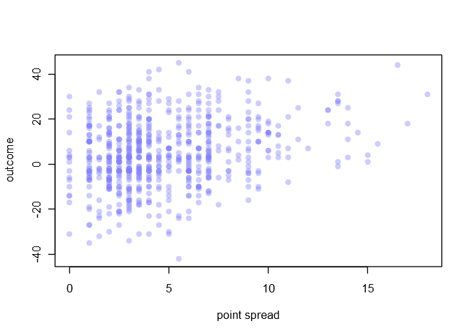
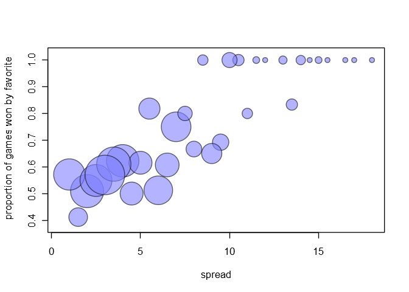
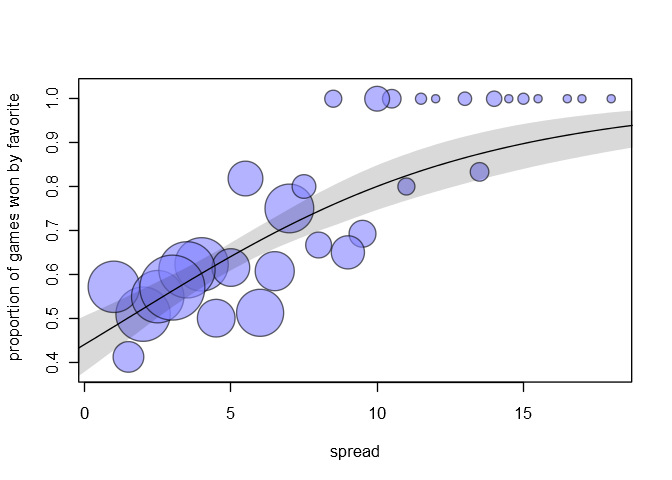
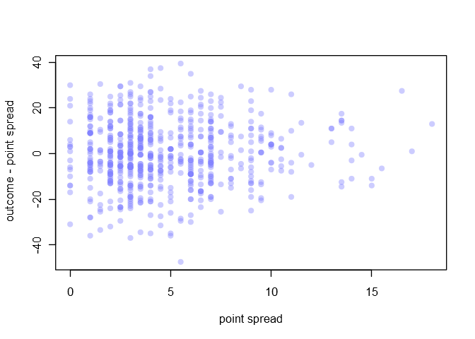
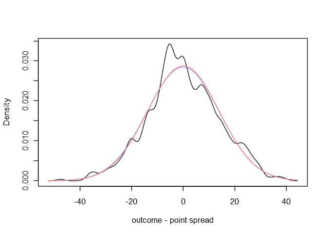
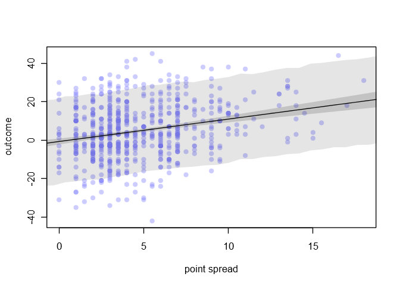
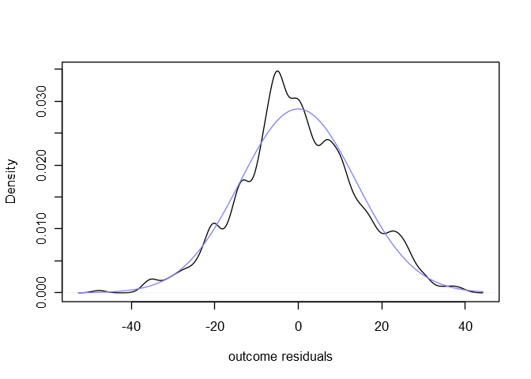

Libraries for models and helper functions for plots:


```r
library(brms)
library(coda)

col.alpha <- function( acol , alpha=0.2 ) {
    acol <- col2rgb(acol)
    acol <- rgb(acol[1]/255,acol[2]/255,acol[3]/255,alpha)
    acol
}

col.desat <- function( acol , amt=0.5 ) {
    acol <- col2rgb(acol)
    ahsv <- rgb2hsv(acol)
    ahsv[2] <- ahsv[2] * amt
    hsv( ahsv[1] , ahsv[2] , ahsv[3] )
}

rangi2 <- col.desat("blue", 0.5)
```

# 1.4 Discrete examples: genetics and spell checking

## 1.4.1 Inference about a genetic status

The first two sons don't have hemophilia. The likelihood of this is (0.5)(0.5) = 0.25 in the case that the mother has hemophilia, and (1)(1) = 1 in the case that the mother does not have hemophilia. We then use Bayes' rule to calculate the posterior probabilities, assuming a flat prior:


```r
prior <- c(1, 1)  # this could be (0.5, 0.5), the scale doesn't matter
likelihood <- c(0.25, 1)
posterior <- prior*likelihood
# standardize the posterior
( posterior <- posterior/sum(posterior) )
```

```
## [1] 0.2 0.8
```

So there is a 20% chance that the mother has hemophilia and an 80% chance that she does not.

The likelihood that the third son doesn't have hemophilia is 0.5 in the case that the mother has it, and 1 if she doesn't. We use the posterior from the last calculation as our prior here:


```r
prior <- posterior
likelihood <- c(0.5, 1)
new_posterior <- prior*likelihood
# standardize the posterior
new_posterior/sum(new_posterior)
```

```
## [1] 0.1111111 0.8888889
```

Now the mother has probability 0.111... (or 1/9) of having hemophilia.

If the third son does have hemophilia, the likelihood of this is 0.5 in the case that the mother has it too, but it's impossible (likelihood = 0) in the case that the mother doesn't have it. Then our new posterior is:


```r
prior <- posterior
likelihood <- c(0.5, 0)
new_posterior <- prior*likelihood
# standardize the posterior
new_posterior/sum(new_posterior)
```

```
## [1] 1 0
```

This says that the mother must have hemophilia (probability 1), and that it is impossible that she doesn't (probability 0).

## 1.4.2 Spelling correction


```r
prior <- c(760, 60.5, 3.12)
likelihood <- c(0.00193, 0.000143, 0.975)
posterior <- prior*likelihood
posterior/sum(posterior)
```

```
## [1] 0.324696347 0.001915128 0.673388524
```

Using this prior and likelihood, we conclude that there is a 67.3% chance that the writer intended to type "radom", a 32.5% chance that the writer intended to type "random", and an insignificant 0.2% chance that the writer intended to type "radon".

>When we dispute the claims of the posterior distribution, we are saying that the model does not fit the data or that we have additional prior information not included in the model so far.

# 1.6 Example: probabilities from football point spreads

## 1.6.1 Football point spreads and game outcomes

The data for this example is available from [Gelman's website](http://www.stat.columbia.edu/~gelman/book/data/).


```r
football <- read.table("football.asc", header = TRUE, skip = 7)[1:672,]
football$outcome <- football$favorite - football$underdog
```

## 1.6.2 Asssigning probabilities based on observed frequencies

Here we plot point spread versus outcome. The points are made slightly transparent so that overlapping points are easier to see.


```r
plot(outcome ~ spread, data = football, xlab = "point spread", pch = 16, col = col.alpha(rangi2, 0.4))
```

<!-- -->


```r
# Pr(favorite wins) (ties are wins here)
sum(football$outcome >= 0 & football$spread >= 0)/nrow(football)
```

```
## [1] 0.6264881
```

```r
# Pr(favorite wins | spread = 3.5)
sum(football$outcome >= 0 & football$spread == 3.5)/sum(football$spread == 3.5)
```

```
## [1] 0.6101695
```

```r
# Pr(favorite wins by more than point spread)
sum(football$outcome > football$spread)/nrow(football)
```

```
## [1] 0.4717262
```

```r
# Pr(favorite wins by more than point spread | spread = 3.5)
sum(football$outcome > football$spread & football$spread == 3.5)/sum(football$spread == 3.5)
```

```
## [1] 0.5423729
```

>These empirical probability assignments all seem sensible in that they match the intuition of knowledgeable football fans. However, such probability assignments are probelmatic for events with few directly relevant data points. For example, 8.5-point favorites won five out of five times during this three-year period, whereas 9-point favorites won thirteen out of twenty times. However, we realistically expect the probability of winning to be greater for a 9-point favorite than for an 8.5-point favorite. The small sample size with point spread 8.5 leads to imprecise probability assignments.

### Predicting the probability of a win with the spread using a binomial model

Let's take a look at the number of data points corresponding to each point spread.


```r
spreads <- unique(football[football$spread > 0,]$spread)
proportion_data <- data.frame(
    spread = spreads,
    games_played = sapply(spreads, function(s) sum(football$spread == s)),
    favorite_wins = sapply(spreads, function(s) sum(football$spread == s & football$outcome > 0))
)
proportion_data
```

```
##    spread games_played favorite_wins
## 1     2.0           55            28
## 2     9.5           13             9
## 3     4.0           53            33
## 4     4.5           26            13
## 5     5.0           26            16
## 6     6.0           41            21
## 7     1.0           49            28
## 8     6.5           28            17
## 9     2.5           51            28
## 10    3.5           59            36
## 11   10.5            6             6
## 12    7.0           44            33
## 13    3.0           79            45
## 14    5.5           22            18
## 15    1.5           17             7
## 16    9.0           20            13
## 17    8.0           12             8
## 18    7.5           10             8
## 19   11.0            5             4
## 20    8.5            5             5
## 21   14.0            4             4
## 22   13.5            6             5
## 23   11.5            2             2
## 24   13.0            3             3
## 25   10.0           11            11
## 26   15.0            2             2
## 27   15.5            1             1
## 28   17.0            1             1
## 29   18.0            1             1
## 30   12.0            1             1
## 31   14.5            1             1
## 32   16.5            1             1
```

There are many games with spreads less than 10, and fewer with higher spreads. Here is a plot showing the proportions of times the favorite team won corresponding to each spread, with the size of the data point corresponding to the number of games played with that spread.


```r
plot(
    0, 0,
    xlab = "spread", ylab = "proportion of games won by favorite",
    xlim = c(0.5*min(spreads), max(spreads)),
    ylim = c(0.38, 1.02),
    type = "n"
)

points(
    spreads, proportion_data$favorite_wins / proportion_data$games_played,
    pch = 21, bg = col.alpha(rangi2, 0.6), col = col.alpha("black", 0.6),
    cex = sqrt(proportion_data$games_played)
)
```

<!-- -->

We want to model the relationship between the spread and the favorite team win rate, taking into account that there is more data available for some spreads than others. We want the larger points in the above plot to carry more weight in the model.

We'll fit a simple binomial model using a logit link with a linear dependence on spread.


```r
football_m1 <- brm(
    favorite_wins | trials(games_played) ~ spread,
    family = binomial(link = "logit"),
    data = proportion_data,
    cores = 4
)
```


```r
summary(football_m1)
```

```
##  Family: binomial 
##   Links: mu = logit 
## Formula: favorite_wins | trials(games_played) ~ spread 
##    Data: proportion_data (Number of observations: 32) 
## Samples: 4 chains, each with iter = 2000; warmup = 1000; thin = 1;
##          total post-warmup samples = 4000
## 
## Population-Level Effects: 
##           Estimate Est.Error l-95% CI u-95% CI Eff.Sample Rhat
## Intercept    -0.24      0.16    -0.55     0.07       1666 1.00
## spread        0.16      0.03     0.10     0.23        948 1.00
## 
## Samples were drawn using sampling(NUTS). For each parameter, Eff.Sample 
## is a crude measure of effective sample size, and Rhat is the potential 
## scale reduction factor on split chains (at convergence, Rhat = 1).
```


```r
spread.seq <- seq(from = -1, to = 19, length.out = 30)

fitprops <- fitted(
    football_m1,
    newdata = list(
        games_played = rep(1, length(spread.seq)),
        spread = spread.seq
    ),
    probs = c(0.055, 0.945)
)

plot(
    0, 0,
    xlab = "spread", ylab = "proportion of games won by favorite",
    xlim = c(0.5, 18),
    ylim = c(0.38, 1.02),
    type = "n"
)

points(
    spreads, proportion_data$favorite_wins / proportion_data$games_played,
    pch = 21, bg = col.alpha(rangi2, 0.6), col = col.alpha("black", 0.6),
    cex = sqrt(proportion_data$games_played)
)

polygon(
    c(spread.seq, rev(spread.seq)), c(fitprops[,3], rev(fitprops[,4])),
    col = col.alpha("black", 0.15), border = NA)

lines(spread.seq, fitprops[,1])
```

<!-- -->

This plot shows the mean fit curve in blue and its 89% credibility interval in gray. Note that the location of the curve is most heavily influenced by the larger dots.

## 1.6.3 A parametric model for the difference between outcome and point spread


```r
plot(
    outcome - spread ~ spread,
    data = football,
    xlab = "point spread", ylab = "outcome - point spread",
    pch = 16, col = col.alpha(rangi2, 0.4)
)
```

<!-- -->

```r
plot(density(football$outcome - football$spread, adj = 0.5), xlab = "outcome - point spread", main = NA)
curve(dnorm(x, 0, 14), col = rangi2, add = TRUE)
curve(
    dnorm(x, mean(football$outcome - football$spread), sd(football$outcome - football$spread)),
    col = col.desat("red", 0.5), add = TRUE
)
```

<!-- -->

In the last plot, the wavy curve represents the empirical density of `outcome - spread`. The blue curve is the Normal(0, 14) density, and the red curve is the normal density with the same mean and standard deviation as `outcome - spread`. The two normal densities are extremely similar.

>...suggesting that the results of football games are approximately normally distributed with mean equal to the point spread and standard deviation nearly 14 points (two converted touchdowns).

>[In this model,] the probability that the favorite wins by more than the point spread is 1/2.

The new probabilities from this model:


```r
# Pr(favorite wins | spread = 3.5)
pnorm(0, mean = 3.5, sd = 14, lower.tail = FALSE)
```

```
## [1] 0.5987063
```

```r
# Pr(favorite wins | spread = 8.5)
pnorm(0, mean = 8.5, sd = 14, lower.tail = FALSE)
```

```
## [1] 0.7281219
```

```r
# Pr(favorite wins | spread = 9)
pnorm(0, mean = 9, sd = 14, lower.tail = FALSE)
```

```
## [1] 0.7398416
```

### Estimating the relationship between outcome and point spread


```r
football_m2 <- brm(
    outcome ~ spread,
    data = football,
    iter = 6e3,  # more samples for a cleaner prediction interval below
    warmup = 1e3,
    chains = 4,
    cores = 4
)
```


```r
summary(football_m2)
```

```
##  Family: gaussian 
##   Links: mu = identity; sigma = identity 
## Formula: outcome ~ spread 
##    Data: football (Number of observations: 672) 
## Samples: 4 chains, each with iter = 6000; warmup = 1000; thin = 1;
##          total post-warmup samples = 20000
## 
## Population-Level Effects: 
##           Estimate Est.Error l-95% CI u-95% CI Eff.Sample Rhat
## Intercept    -0.72      0.97    -2.64     1.20      20409 1.00
## spread        1.17      0.18     0.82     1.50      19747 1.00
## 
## Family Specific Parameters: 
##       Estimate Est.Error l-95% CI u-95% CI Eff.Sample Rhat
## sigma    13.87      0.38    13.16    14.64      21258 1.00
## 
## Samples were drawn using sampling(NUTS). For each parameter, Eff.Sample 
## is a crude measure of effective sample size, and Rhat is the potential 
## scale reduction factor on split chains (at convergence, Rhat = 1).
```

As expected from the discussion just above, the coefficient for `spread` is very close to 1 and the intercept is very close to 0.

Below we plot the mean fit line and the 89% interval for this mean (the thinner shaded region). The wider and lighter shaded region is the 89% prediction interval, in which the model expects to see 89% of future data.


```r
spread.seq <- seq(from = -1, to = 19, length.out = 30)

fitoutcomes <- fitted(football_m2, newdata = list(spread = spread.seq), probs = c(0.055, 0.945))

prediction_interval <- apply(
    posterior_predict(football_m2, newdata = list(spread = spread.seq)),
    2, function(x) HPDinterval(as.mcmc(x), prob = 0.89)
)

plot(outcome ~ spread, data = football, xlab = "point spread", pch = 16, col = col.alpha(rangi2, 0.4))

polygon(
    c(spread.seq, rev(spread.seq)), c(fitoutcomes[,3], rev(fitoutcomes[,4])),
    col = col.alpha("black", 0.15), border = NA)

polygon(
    c(spread.seq, rev(spread.seq)), c(prediction_interval[1,], rev(prediction_interval[2,])),
    col = col.alpha("black", 0.1), border = NA
)

lines(spread.seq, fitoutcomes[,1])
```

<!-- -->

Let's plot the new residuals:


```r
outcome_resid <- residuals(football_m2)[,1]
plot(density(outcome_resid, adj = 0.5), xlab = "outcome residuals", main = NA)
curve(dnorm(x, 0, sd(outcome_resid)), col = rangi2, add = TRUE)
```

<!-- -->

This is virtually indistinguishable from the density for `outcome - spread` plotted above.

Here are the new probabilities we estimate:


```r
sigma <- summary(football_m2)$spec_pars["sigma", 1]
# Pr(favorite wins | spread = 3.5)
mu <- fitted(football_m2, newdata = list(spread = 3.5))[1,1]
pnorm(0, mean = mu, sd = sigma, lower.tail = FALSE)
```

```
## [1] 0.5958715
```

```r
# Pr(favorite wins | spread = 8.5)
mu <- fitted(football_m2, newdata = list(spread = 8.5))[1,1]
pnorm(0, mean = mu, sd = sigma, lower.tail = FALSE)
```

```
## [1] 0.7464771
```

```r
# Pr(favorite wins | spread = 9)
mu <- fitted(football_m2, newdata = list(spread = 9))[1,1]
pnorm(0, mean = mu, sd = sigma, lower.tail = FALSE)
```

```
## [1] 0.7597572
```


### Comparison with the probabilities from the binomial model

Here are the probabilities from the binomial model:


```r
# Pr(favorite wins | spread = 3.5)
fitted(football_m1, newdata = list(games_played = 1, spread = 3.5), probs = c(0.055, 0.945))[1,]
```

```
##  Estimate Est.Error      Q5.5     Q94.5 
## 0.5825208 0.0210773 0.5481639 0.6161191
```

```r
# Pr(favorite wins | spread = 8.5)
fitted(football_m1, newdata = list(games_played = 1, spread = 8.5), probs = c(0.055, 0.945))[1,]
```

```
##   Estimate  Est.Error       Q5.5      Q94.5 
## 0.75932412 0.02810293 0.71381846 0.80341281
```

```r
# Pr(favorite wins | spread = 9)
fitted(football_m1, newdata = list(games_played = 1, spread = 9), probs = c(0.055, 0.945))[1,]
```

```
##   Estimate  Est.Error       Q5.5      Q94.5 
## 0.77374893 0.02924231 0.72644364 0.81889243
```

***

[Antonio R. Vargas](https://github.com/szego)

03 Nov 2018


